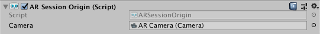

# 介绍
[文档原地址5.0-pre.9](https://docs.unity3d.com/Packages/com.unity.xr.arfoundation@5.0/manual/index.html)
### 关于ARFoundation
AR Foundation给与你使用Unity来实现跨平台开发AR的能力。这个包给Unity的开发者提供了一些接口，但它并不基于AR的功能。想要在设备上使用ARFoundation，你还需要一些其它官方的支持包：
* [Google ARCore XR Plugin-on](https://docs.unity3d.com/Packages/com.unity.xr.arcore@5.0/manual/index.html) on Android
* [Apple ARKit XR Plug-in](https://docs.unity3d.com/Packages/com.unity.xr.arkit@5.0/manual/index.html) on iOS
* [OpenXR Plug-in](https://docs.unity3d.com/Packages/com.unity.xr.openxr@1.2/manual/index.html) on HoloLens

#### 特性(Feature)
ARFoundation是一组基于MonoBehavior的Api，用来实现以下功能：
* 设备跟踪(Device tracking):跟踪设备在物理空间的位置和姿态。
* 平面检测(Plane detection):检测水平和垂直的平面。
* 点云(Point clouds): 特征点
* 锚点(Anchor): 设备跟踪的任意位置和姿态。
* 光线评估(Light estimation): 评估物理空间的色温和光线亮度。
* 环境探头(Environment probe): 为物理环境中的特定区域生成CubeMap。
* 面部追踪(Face tracking): 对人脸进行检测并且追踪。
* 2D图像追踪(2D image tracking): 对2D图像检测并追踪。
* 3D物体追踪(3D object tracking): 对3D物体进行检测。
* 建立网格(Meshing): 生成相对于物理空间的三角形网格。
* 人体追踪(Body tracking): 在屋里空间中识别2D或者3D的人。
* 多人交互(Colaboratice participants): 追踪其它共享的AR设备的位置和姿态。
* 人体分割(Human segmentation): 划分摄像机中的人的图像的stencil texture和depth map。我理解的是将识别出的人进行各部分的划分。
* 射线检测(Raycast): 在检测到的周围物理世界(平面，特征点)中查询。
* Pass-through video: 优化渲染摄像机的内容作为背景到屏幕上。
* 会话管理(Session management): 自动管理AR功能的开启可关闭。
* 遮挡剔除(Occlusion): 允许基于环境和人体的虚拟内容闭塞。暂时没搞懂。

### 平台支持
AR Foundation本身并不实现任何的AR功能，然而定义了一套跨平台的API来允许你使用通用的方法去实现跨平台。  
#### 平台支持情况
| |ARCore|ARKit|OpenXR|
|--|--|--|--|
|Device tracking|√|√|√|
|Plane tracking|√|√||
|Point clouds|√|√||
|Anchors|√|√|√|
|Light estimation|√|√||
|Environment probes|√|√||
|Face tracking|√|√||
|2D Image tracking|√|√||
|3D Object tracking||√||
|Meshing||√|√|
|2D & 3D body tracking||√||
|Collaborative participants	||√||
|Human segmentation	||√||
|Raycast|√|√||
|Pass-through video	|√|√||
|Session management	|√|√|√|
|Occlusion|√|√||

**注意:** 如果使用ARCore cloud anchors，需要下载安装[ARCore Extensions for Unity's AR Foundation](https://developers.google.com/ar/develop/unity-arf)

#### 支持的包
以下的包对应上述AR Foundation的特性。

|包|版本|
|--|--|
| Google ARCore XR Plug-in | 5.0 |
| Apple ARKit XR Plug-in | 5.0 |
| OpenXR Plug-in | 1.2 |

#### SubSystems
AR Foundation在子系统的基础上构建。[Subsystem](subsystem)是一个平台无关的提供各种信息的接口。ARFoundation中的AR-related子系统使用的命名空间是
`UnityEngine.XR.ARSubsystems`，然而只是偶尔需要使用这个命名空间下的东西。  
每一个子系统控制单独的功能，例如`XRPlaneSubsustem`提供平面检测的接口。

#### Providers
provider是一个子系统的具体实现，例如`Google ARCore XR Plug-in`包包含了ARCore杜宇AR-related子系统的实现。  
因为不同的provider实现不同的功能，因此每一个子系统都有一个描述来表明哪一个子系统支持这个功能。例如`XRPlaneSubsystemDescriptor`中包含一些属性表明它是否支持水平或垂直的平面检测。  
每个Provider又决定了如何实现这个子系统，通常它只是封装了各个平台的SDK，例如ios平台的ARKit和Android平台的ARCore。

### 安装ARFoundation
这里不再赘述翻译了，简单来说就是要从`PackageManger`(Window > PackageManger)中安装如下包:

* ARFoundation
* Google ARCore XR Plug-in
* Apple ARKit XR Plug-in
* OpenXR Plug-in

其中后三者根据自己的需求来选择。

#### 术语
| 词语 | 解释 |
|--|--|
|Tracking|基于AR设备的能力来确定在物理空间中的位置和姿态，如果在暗光环境下，这种能力可能会丢失|
|Trackable|基于AR设备的检测和跟踪的真实的物理环境|
|Feature Point|点云中的特殊的点(特征点)。AR设备使用摄像头或者图片来分析最总真实世界中的特殊点，并使用这些点来构架哪一张环境地图。|
|Session|一个AR的示例|
|Session Space|AR Session创建的空间坐标|

### 使用ARFoundation

[ARFoundation Samples](https://github.com/Unity-Technologies/arfoundation-samples) on GitHub

引入和配置部分原文档使用了图片，不太好描述，故录了一段视频说明。

<video width="768" height="432" controls>
  <source src="media/use.mp4" type="video/mp4">
</video>

文档中关于ARSession的说明:

一个AR场景应该包含一个ARSession组件。这个组件控制着整个AR的生命周期，包括启用禁用等。如果关闭了ARSession组件，系统将不在从环境中检测特征，
假如后来用代码enable了这个组件，系统会尝试恢复之前的状态。


如果勾选了Attempt Update选项，如果可能的话系统会尝试安装AR软件(我理解的即ARSDK)，
> ARSession组件在每个场景中仅需一个。

#### 检测设备是否支持

##### ARSession

在一些平台上，坑你系统仅支持部分的AR特性，在这类的系统上，你的应用程序需要检测是否支持ARFoundation，来选择一些其它的操作。

在ARSession中，有一个静态的协程，你可以在运行中使用它来判断是否支持AR功能。

```C#
public class MyComponent{
    [SerializeField] ARSession _m_Session;

    IEnumerator Start(){
        if((ARSession.state == ARSessionState.None) || 
        (ARSession.state == ARSessionState.CheckingAvailability)){
            yield return ARSession.CheckAvailablility();
        }

        if(ARSession.state == ARSessionState.Unsupported){

        }else{
            m_Session.enable = true;
        }
    }
}
```

##### SessionState
你可以使用`ARSession.state`和`ARSession.stateChange`两种方式来判断平台对于AR的支持情况。

|ARSessionState|说明|
|--|--|
| None | ARSystem没有初始化，能力可用性未知。 |
| Unsupported | 当前设备不支持AR |
| CheckingAvailability | 系统正在检测AR能力是否支持 |
| NeesInstall | 当前设备支持AR功能，但是需要安装ARSDK |
| Installing | 正在安装 |
| Ready | 安装完成 |
| SessionInitialized| ARSession初始化完成。通常表示AR可以工作了 |
| SessionTracking | ARSession正在工作，并且正在定位设备在物理空间的状态 |

#### ARSessionOrigin


它的作用是将各种Trackable，例如平面和特征点，转换到它们最终的位置、姿态、大小到Unity的坐标系。因为AR设备在“会话空间”提供数据，这可能是
任何一个相对于ARSession初始化时候的位置，ARSessionOrigin负责响应的转换工作。  
这个概念有点像模型的本地坐标和世界坐标的区别，文档中举例了当导入一个模型的时候，门的位置相对于模型的创建者，这被称为模型坐标，或者本地坐标。
当模型被实例化的时候，它就有了一个Unity中的世界坐标。举这个例子大概是在说ARSessionOrigin负责的事情。

同样的，可被AR设备追踪的物体，例如平面，它提供了一个相对于设备坐标系统的“session space”，当它被初始化成GameOBject的时候，它们就有了一个word space。
为了将它们初始化在正确的地方，ARFoundation需要知道ARSessionOrigin在Unity场景中的位置。

ARSessionOrigin允许你缩放虚拟的内容，并设置相对于AR Camera的offset。如果你缩放，并移动了ARSessionOrigin，AR Camera需要是ARSessionOrigin的一个子节点。
因为AR Camera是基于AR技术的相机，这样的设置允许AR Camera和发现的trackbales一起移动。

**Scale 缩放**

设置transform的scale，可以将缩放应用于ARSessionOrigin，这会影响到AR设备的所有数据，包括摄像机的位置和所有见到到的trackables。值越大，AR content显示就越小。例如，
缩放是10，这会让你的AR content看起来缩小10倍，如果设置为0.1，AR content则会扩大十倍。

#### AR Camera Manager

ARCameraManager的功能基于AR相机，包括设备相机纹理的管理和光照属性模式的设置。


| Setting | Funcion |
| -- | -- |
| Auto Focus| 控制相机的自动对焦，如果相机不支持，会忽略 |
| Light Estimation| 评估照明环境属性，有无关选项：<br> **Ambient Intensity:** 评估周围环境的平均亮度 <br> **Ambient Color:** 评估周围环境的萍爵颜色 <br> **Ambient Spherical Harmonics:** [评估球谐函数](https://zhuanlan.zhihu.com/p/351289217)表示的场景常用来实时光照计算 <br> **Main Light Direction:** 评估主光源方向。<br> **Main Light Intensity:** 评估主光源的亮度 <br> 这些特性并不是所有的AR设备都支持，或者依赖于其它的特性，例如相机的朝向 |

#### AR Camera background

如果你想把相机设备的视频实时渲染在场景的背景上，你需要给相机添加ARCameraBackground组件，否则相机会应用Camera.clearFlags设置。ARCameraBackground组件订阅了ARCamera的事件，并每帧渲染到屏幕上。这并不是必须的，但对于AR项目一般是这样。

Custom Material属性是可先的，通常你不需要设置它。Unity的不同Provider会包含不同平台的shader去渲染背景，例如ARCore和ArKit。

如果你只有一个ARSessionOrigin，你只需要吧ARCameraBackground组件添加到摄像机即可。如果有多个ARSessionOrigin，例如不通的物体使用了不同的缩放，你需要为每个ARSessionOrigin设置不同的相机，一个ARCamera对应一个ARCameraBackground。

[使用URP配置ARCameraBackground](https://docs.unity3d.com/Packages/com.unity.xr.arfoundation@5.0/manual/ar-camera-background-with-scriptable-render-pipeline.html)

#### Automatic occlusion 自动遮挡

一些设备可以提供真实世界的深度信息。例如有一个特性叫做person occlusion，使用了 >= A12仿生芯片的iOS设备可以在人物检测时提供深度信息。新的Android手机和iOS设备配备了LiDAR(激光雷达)扫码，可以提供一个深度信息的图像，其中包含设备和物理环境中每一个像素的深度评估。

这一部分不做过多翻译，一是因为设备太新，用户太少，二是本人暂时未涉及这方面。

#### Accessing the Camera Image on the CPU
从CPU访问Camera Image，参见文档[camera images](camera_image)。

#### AR input manager

ARInputManger组件需要开启世界追踪。如果没有开启，Tracked Pose Driver就无法获取设备的姿态。

> 这个组件可以放在你场景的任何地方，但是只能有一个。

#### Trackable managers

详见文档[trackable managers](trackables)

#### Visualizing trackables

Tracable组件本身自己什么都不做，它们关联每个trackable的数据，我们有很多方法可以可视化trackables。因此ARFoundation包含一些可视化的组件，你可以用来调试或者作为你应用的起点。

#### Ray casting

详见文档[ARRaycastManager](raycasting)

#### Meshing

详见文档[ARMeshManager](trackables#meshing-)

#### Technical details

##### Requirements
此版本的ARFoundation兼容如下的Unity版本:  
* 2021.2
* 2022.1