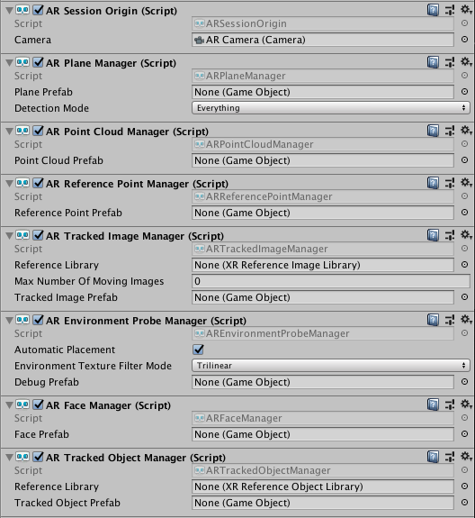
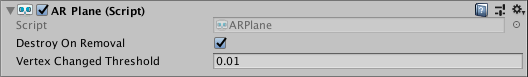
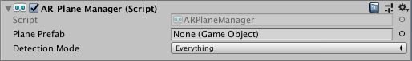
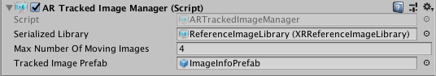

## Trackable managers

在ARFoundation中，"trackable"可以是真实世界中检测到并最总的任何事物，地面、点云、锚点、环境探针、人脸、图片或者3d物体都是可以被追踪的trackables。

每个trackable都有一个trackable manager。所有的managers都必须在同一个ARSessionOrigin上，这是因为ARSessionOrigin定义了所有的可被检测到的trackables的相对的转换。trackable manager使用ARSessionOrigin当前的位置去生成检测到的trackables到场景中。

以下是ARSessionOrigin上所有的trackable managers:



以下表格概述trackable manager以及对应的trackables:

| Trackable Manager | Trackable | 含义(Purpose) | 
| -- | -- | -- |
| ARPlaneManager | ARPLane | 发现平坦的表面 |
| ARPointCloudManager | ARPointCloud | 发现特征点 |
| ARAnchorManager | ARAnchor | 管理锚点，你可以使用如下的api动态的添加和删除它们:<br>`ARAnchorManager.AddAnchor` <br>`ARAnchorManager.RemoveAnchor` |
| ARRaycastManager | ARRaycast | 自动重复和更新射线? |
| ARTrackedImageManager | ARTrackedImage | 发现并追踪2D图像 |
| AREnvironmentProbeManager | AREnvironmentProbe | 创建当前环境的cubemap |
| ARFaceManager | ARFace | 检测跟踪人脸 | 
| ARTrackedObjectManager | ARTrckedObject | 检测3D物体 | 
| ARParticipantManager | ARParticipant | 管理多用户的session |

每一个trackable组件都存储了关于这个trackable的信息，
但无法可视化，当AR设备report一个update的时候，它负责去update transform。

### Enabling and disabling features

开启和关闭某项功能，只需要disable对应的Manager即可。比如某项耗费性能的功能在不使用的时候可以关闭。

### Enumerating trackables

Tracables可以使用对应Manager的trackables变量来读取遍历，例如:
```C#
var planeManager = GetComponent<ARPlaneManager>();
foreach (ARPlane plane in planeMnager.trackables)
{
    // Do something with the ARPlane
}
```

tracables属性返回一个集合，你还可以通过TryGetTrackable方法来获取。

### Trackable lifetime

每个trackable都能够被added、updated、removed。在每一帧中，managers都会查询上一帧的改变，每个manager都有一个可被订阅的事件:

| Trackable Manager | Event | 
| -- | -- |
| ARPlaneManager | planesChanged |
| ARPointCloudManager | pointCloudsChanged |
| ARAnchorManager | anchorsChanged |
| ARTrackedImageManager	| trackedImagesChanged |
| AREnvironmentProbeManager	| environmentProbesChanged |
| ARFaceManager	| facesChanged |
| ARTrackedObjectManager | trackedObjectsChanged |
| ARParticipantManager | participantsChanged |

一个trackable在updated和remoed之前必须added。

### Adding and removing trackables

一些trackables，例如anchors和环境探针，可以被手动的添加和删除。其它的trackables，例如planes，是自动添加和删除。有些可以手动添加和创建，如果支持，相关的managers会提供添加和删除的方法。

你不能直接Destroy一个trackable组件或者它的GameObject，支持手动删除的trackables，它的providers会提供响应的删除方法。例如要删除anchor，你需要第阿勇ARAnchorManager的RemoveAnchor方法。

当你手动add了一个trackable，底层子系统可能不会立即跟踪它。在子系统报告它将要被添加之前你不会收到他的added事件(通常会是在下一帧)，在手动添加到收到added事件的这段时间，trackable处于”pending“状态，可以在任何trackable上使用pending属性来检测。具体pending状态耗费的时间，是由低层决定的。

当trackable收到移除的通知后，它的manager会Destroy这个tracable的GameObject，除非destroyOnDemoval是false。



<p id="donot-destroy"></p>

**Deactivating existing trackables**

有时候，你可能想在不关闭manager的情况下停止一个trackable。例如你希望在不停止地面检测的情况下停止地面的渲染，要想实现这一点，可以deactive每个trackable的GameObject:

```C#
var planeManager = GetComponent<ARPlaneManager>();
foreach(var plane in planeManager.trackables){
    plane.gameOBject.SetActive(false);
}
```

### Controlling a trackable's GameObject

当一个新的tackable被检测到的时候，它的manager会初始化一个Prefab。这个初始化的GameObject一定要有一个与之类型对应的ARTrackable组件。如果这个Prefab是null，系统会创建一个只包含先关ARTrackable组件的GameObject。如果你的Prefab没有相对的ARTrackable，系统会添加一个。

例如，当plane manager见到一个plane的时候，如果指定了”Plane Prefab“，manager会创建它的GameObject，否则创建一个空的GameObject，然后为其添加ARPlane组件。

## Plane Detection

### AR plane manager
plane manager是[trackable manager](trackables#trackable-managers)的一种。



plane manager为在环境中检测到的每一个plane创建GameObject。一个plane代表一种姿态的平面、尺寸和边界点。边界点是convex的。

这个特性的例子是可以在环境中检测水平桌面、地板、平面，台面和垂直的墙。

你可以指定检测的模式，水平，垂直还是全都要。垂直的面检测在一些平台上需要额外的工作，如果你只是需要水平的面检测，你最好关闭垂直方向的检测。


### Responding to planes

面可以添加、删除和更新。在每一帧，AR plane manager都会调用planesChanged事件来返回上一帧中添加、删除和更新的面。

当一个面被检测到，AR Plane Manager会初始化代表这个面的Plane Prefab。这个Prefab可以是null，但是manager会确保初始化的GameObject用于ARPlane组件。ARPlane组件只包含关于检测到的面的数据。

当一个面updated，就好比他的边界顶点发生了变化。你可以订阅面的`ARPlane.boundaryChanged`事件来接收通知。这个事件只会在至少一个边界顶点大于了设置的Vertex Changed Threshold阈值时触发，或者定点数发生了变化。

### Visualizing planes

要实现面的可视化，你需要创建一个包含ARPlane组件的Prefab或者GameObject，订阅它的boundaryChanged事件。ARFoundation提供了一个ARPlaneMeshVisualizer。这个组件会根据边界顶点生成mesh，并将它分配给如果存在的MeshCollider,MeshFilter或者LineRenderer。

创建一个用来生成Prefab的GameObject。。。。 具体的创建过程不再赘述，可以自行参考文档。

### Disabling planes

同[Deactivating existing trackables](#donot-destroy)

## Image Tracking

### AR tracked image manager

图像追踪管理器是追踪2D图像的一种类型的trackable manager



图像追踪管理器为在环境中追踪到的图像创建GameObject，在一个图像可被追踪之前，图像必须被编译到一个图像库当中。manager只能从这个图像库当中检测图片。

### Reference library

如何创建一个图像参考库，请看文档[Tracked Image Subsystem](subsystem#image-tracking)

图像管理库的图片可以在运行时赋值，但要保证manager在enable的时候refrenceLibrary必须非空。

图像库分为[XRReferenceImageLibrary](https://docs.unity3d.com/Packages/com.unity.xr.arfoundation@5.0/api/UnityEngine.XR.ARSubsystems.XRReferenceImageLibrary.html) 和 [RuntimeReferenceImageLibrary](https://docs.unity3d.com/Packages/com.unity.xr.arfoundation@5.0/api/UnityEngine.XR.ARSubsystems.RuntimeReferenceImageLibrary.html)。你只能在Editor中创建一个图像库，并且不能在运行时改变它。`RuntimeReferenceImageLibrary`是图像库在运行时的一个表现，当你设置了一个图像库引用的时候，image trackaing subsystem会自动转化为`RuntimeReferenceImageLibrary`来使用。

同时你可以可以使用`ARTrackedImageManager.CreateRuntimeLibrary`方法来创建一个`RuntimeReferenceImageLibrary`:

```C#
XRReferenceImageLibrary serializedLibrary = ...
RuntimeReferenceImageLibrary runtimeLibrary 
  = trackedImageManager.CreateRuntimeLibrary(serializedLibrary);
```

> 在`RuntimeReferenceImageLibrary`中，图片的顺序是无法定义的，也就是说它不能够匹配出图像源在图像库中的顺序。你可以为每个图像源设置一个string name和一个随机的GUID，这个GUID是相同的。

### Using reference image libraries with asset bundles

在4.2版本的ARFoundation中，图像库必须在Player中创建，它只能作为一种打包在app中的用于数据查找的手段。这就意味着在已经发布的app中你不能下载一个新的图像库。但是从4.2版本开始，你可以把图像库作为打入asset bundle来使用。

### Responding to detected images

订阅`ARTrackedImageManager`的`trackedImagesChanged`事件接收图像added(第一次发现),updagted和removed。

``` js
[SerializeField]
ARTrackedImageManager m_TrackedImageManager;

void OnEnable() => m_TrackedImageManager.trackedImagesChanged += OnChanged;

void OnDisable() => m_TrackedImageManager.trackedImagesChanged -= OnChanged;

void OnChanged(ARTrackedImagesChangedEventArgs eventArgs) {
    foreach (var newImage in eventArgs.added) {
        // Handle added event
    }

    foreach (var updatedImage in eventArgs.updated) {
        // Handle updated event
    }

    foreach (var removedImage in eventArgs.removed) {
        // Handle removed event
    }
}
```

注意，images可以使用[Tracking State](#tracking-state)来设置跟踪的质量。

一张图片从View范围移走的时候，它可能并没有被"removed"，但是它的tracking state可能发生改变。

你可以使用ARTrackedImageManager的[trackables](https://docs.unity3d.com/Packages/com.unity.xr.arfoundation@5.0/api/UnityEngine.XR.ARFoundation.ARTrackableManager-5.html#UnityEngine_XR_ARFoundation_ARTrackableManager_5_trackables)属性来获取当前被追踪到的图片集合，它有点像IEnumerable集合，所以你可以使用foreach语法:

``` js
void ListAllImages()
{
    Debug.Log(
        $"There are {m_TrackedImageManager.trackables.count} images being tracked.");

    foreach (var trackedImage in m_TrackedImageManager.trackables)
    {
        Debug.Log($"Image: {trackedImage.referenceImage.name} is at " +
                  $"{trackedImage.transform.position}");
    }
}
```

或者使用[TrackableId](https://docs.unity3d.com/Packages/com.unity.xr.arfoundation@5.0/api/UnityEngine.XR.ARSubsystems.TrackableId.html)来访问一张特定的图片。

### Tracked Image Prefab

[ARTrackedImageManager](https://docs.unity3d.com/Packages/com.unity.xr.arfoundation@5.0/api/UnityEngine.XR.ARFoundation.ARTrackedImageManager.html)有一个"[Tracked Image Prefab](https://docs.unity3d.com/Packages/com.unity.xr.arfoundation@5.0/api/UnityEngine.XR.ARFoundation.ARTrackedImageManager.html#UnityEngine_XR_ARFoundation_ARTrackedImageManager_trackedImagePrefab)"字段，当一个图片被识别的时候，ARFoundation会为其创建一个新的GameObject。

如果Prefab是null，ARFoundation会创建一个空的GameObject，并为其添加[ARTrackedImage](https://docs.unity3d.com/Packages/com.unity.xr.arfoundation@5.0/api/UnityEngine.XR.ARFoundation.ARTrackedImage.html)组件。如果你希望每一个被追踪到的图片还包含一些额外的组件，你可以提供一个Prefab来供ARFoundation实例化，换句话说Prefab字段的目的是用来扩展tracked image的默认behavior;这不是一个在场景中创建内容的推荐方式。

！！！！！！！！！！！！！！！！！！！！！！！！！！！！！！！！！！！！！！！！！！！！！！！！！！！！！！！！！！！！！
如果你想在tracked image的位置实例化content，并且自动的更新位置信息，你需要将content设置为`ARTrackedImage`的父级。

### Adding new reference images at runtime


### Tracking State

## Object Tracking
## Face Tracking
## Anchors
## Raycasts
## Point Clouds
## Environment Probes
## Participants
## Meshing